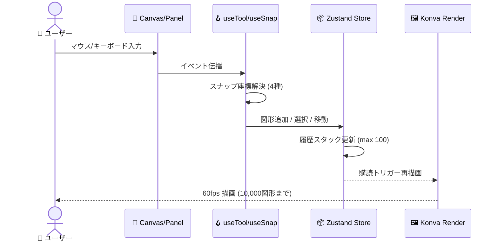
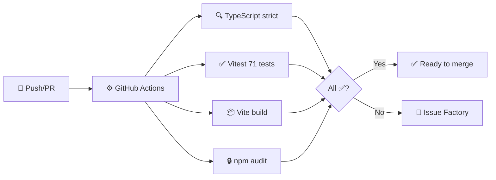
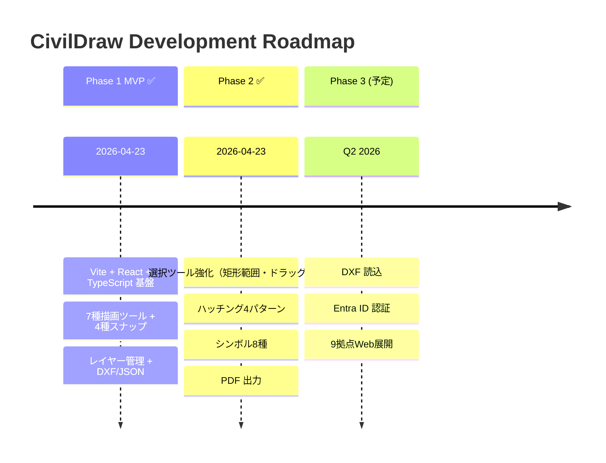

# 🏗️ CivilDraw

**建設土木業向け Web ベース 2D CAD ツール** — Construction Civil Engineering Web CAD

> 📄 **社内限ドキュメント番号**: CAD-REQ-2026-001 v1.0 | ITシステム運用管理部

[](https://github.com/Kensan196948G/Civil-Draw/actions/workflows/ci.yml)


---

## 🎯 概要

AutoCAD 等の高価な商用 CAD に代わる、建設土木業に特化した内製 Web CAD ツールです。ブラウザのみで動作し、社内 9 拠点への展開を目的としています。

| 🧩 | 特徴 |
|---|---|
| 📐 | 仮設計画・土工計画・施工ヤード配置・道路舗装計画の平面図作成 |
| 📤 | DXF R2010 出力（AutoCAD 2010+ / JW-CAD 互換） |
| 🔒 | オフライン完全動作（外部サーバー通信なし） |
| ✅ | ISO 27001・J-SOX 準拠設計 |

---

## 🛠️ Tech Stack

| 区分 | 技術 | バージョン |
|------|------|-----------|
| ⚛️ フレームワーク | React + TypeScript | 18.x / 5.x |
| ⚡ ビルド | Vite | 5.x |
| 🎨 描画エンジン | Konva.js + react-konva | 9.x / 18.x |
| 📦 状態管理 | Zustand | 4.x |
| 📄 DXF 出力 | dxf-writer | 1.18.x |
| 💅 スタイル | Tailwind CSS | 3.x |
| ✅ テスト | Vitest + Testing Library | 2.x |

---

## 🚀 Getting Started

```bash
git clone https://github.com/Kensan196948G/Civil-Draw.git
cd Civil-Draw
npm install
npm run dev
```

🌐 ブラウザで `http://localhost:5173` を開く。

### 📝 主なコマンド

| コマンド | 説明 |
|----------|------|
| `npm run dev` | 🔧 開発サーバー起動 |
| `npm run build` | 📦 本番ビルド (dist/) |
| `npm run preview` | 👀 ビルド成果物プレビュー |
| `npm run test` | ✅ 全テスト実行 |
| `npm run test:coverage` | 📊 カバレッジ付きテスト |
| `npm run lint` | 🔍 ESLint + 型チェック |

---

## 🏛️ アーキテクチャ

```mermaid
graph TB
    subgraph UI["🎨 UI Layer (React Components)"]
        Toolbar[📋 上部ツールバー<br/>ファイル/縮尺/用紙/DXF/PDF]
        ToolPanel[⚒️ 左パネル 60px<br/>9種ツール選択]
        Canvas[🖼️ キャンバス<br/>Konva.js Stage]
        Options[⚙️ ツールオプション<br/>ハッチ/シンボル設定]
        LayerPanel[📚 レイヤーパネル 240px<br/>色/線種/表示/ロック]
        PropertyPanel[🧰 プロパティ編集]
        StatusBar[📊 ステータスバー<br/>座標/縮尺/スナップ]
    end

    subgraph Hooks["🪝 Hooks"]
        useCanvas[useCanvas<br/>ズーム・パン・座標変換]
        useSnap[useSnap<br/>スナップ計算]
        useTool[useTool<br/>ツールイベント + 選択]
    end

    subgraph Store["📦 Zustand Store"]
        canvasStore[canvasStore<br/>ズーム/パン/縮尺/用紙]
        layerStore[layerStore<br/>レイヤー/図形/履歴100]
        toolStore[toolStore<br/>アクティブツール/設定]
    end

    subgraph Utils["🔧 Utils Layer (92% Coverage)"]
        snapEngine[snapEngine<br/>グリッド/端点/中点/交点]
        dxfExporter[dxfExporter<br/>DXF R2010 / JSON]
        gridRenderer[gridRenderer<br/>Konva グリッド描画]
        selection[selection<br/>BBox/矩形選択/ヒットテスト]
        hatchGenerator[hatchGenerator<br/>パターン + ポリゴンクリップ]
        symbolCatalog[symbolCatalog<br/>8種シンボル定義]
    end

    Canvas --> useCanvas & useSnap & useTool
    useSnap --> snapEngine
    useTool --> selection
    Canvas --> gridRenderer & hatchGenerator & symbolCatalog
    useTool --> layerStore & toolStore
    Canvas --> layerStore & toolStore
    Toolbar --> canvasStore & layerStore & dxfExporter
    ToolPanel & Options --> toolStore
    LayerPanel --> layerStore
    PropertyPanel --> layerStore
    StatusBar --> canvasStore & layerStore & toolStore
```



### 🔄 データフロー



---

## 📁 ディレクトリ構成

```
src/
├── 🎨 components/
│   ├── Canvas/          # Konva Stage + ShapeRenderer
│   ├── Toolbar/         # 上部: ファイル・縮尺・DXF・PDF
│   ├── ToolPanel/       # 左: 9種ツール + オプション
│   ├── LayerPanel/      # 右: レイヤー管理
│   ├── PropertyPanel/   # 右下: 選択図形編集
│   └── StatusBar.tsx
├── 🪝 hooks/
│   ├── useCanvas.ts
│   ├── useSnap.ts
│   └── useTool.ts
├── 📦 store/
│   ├── canvasStore.ts
│   ├── layerStore.ts   # + 100ステップUndo/Redo
│   └── toolStore.ts
├── 🔧 utils/
│   ├── dxfExporter.ts      # DXF R2010 + JSON
│   ├── snapEngine.ts       # 4種スナップ
│   ├── selection.ts        # BBox/矩形選択
│   ├── hatchGenerator.ts   # パターン生成
│   ├── symbolCatalog.ts    # 8シンボル
│   └── gridRenderer.ts
└── 📝 types/
    ├── geometry.ts     # Line/Rect/Circle/Polyline/Text/Dimension/Hatch/Symbol
    └── layer.ts
```

---

## ✨ 機能一覧

### ✅ Phase 1 MVP (完了)

| 機能ID | 機能名 | 状態 |
|--------|--------|------|
| CV-001 | 🔍 ズーム操作 (0.1x〜50x) | ✅ |
| CV-002 | ✋ パン操作 (Space+ドラッグ / 中ボタン) | ✅ |
| CV-003 | 🔲 グリッド表示 (縮尺連動) | ✅ |
| CV-004 | 🧲 スナップ (グリッド/端点/中点/交点) | ✅ |
| CV-005 | 📍 座標表示 (実寸m) | ✅ |
| CV-006 | 📏 縮尺設定 (1/50〜1/1000) | ✅ |
| CV-007 | 📄 用紙設定 (A4〜A0 縦横) | ✅ |
| DT-001 | 🖱️ 選択・移動・矩形範囲選択 | ✅ |
| DT-002 | ➖ 線分ツール | ✅ |
| DT-003 | ⬜ 矩形ツール | ✅ |
| DT-004 | ⭕ 円ツール | ✅ |
| DT-005 | 📐 ポリラインツール | ✅ |
| DT-006 | 🔤 テキストツール | ✅ |
| DT-007 | ↔️ 寸法線ツール | ✅ |
| DT-010 | ↩️ Undo/Redo (Ctrl+Z/Y, 100ステップ) | ✅ |
| LY-001 | 📚 レイヤー追加/削除/名称変更 | ✅ |
| LY-002 | 👁️ 表示/非表示 | ✅ |
| LY-003 | 🔒 ロック機能 | ✅ |
| LY-004 | 🎨 色・線種・線幅設定 | ✅ |
| LY-005 | ⚙️ デフォルト5レイヤー | ✅ |
| LY-006 | 📤 DXF出力時レイヤー情報保持 | ✅ |
| IO-001 | 📄 DXF R2010 出力 | ✅ |
| IO-002 | 💾 JSON 内部保存 | ✅ |
| IO-003 | 📂 JSON 読込 | ✅ |

### ✅ Phase 2 (完了)

| 機能ID | 機能名 | 状態 | 詳細 |
|--------|--------|------|------|
| DT-008 | 🧱 ハッチングツール | ✅ | 平行/クロス/土工/砂利の4パターン |
| DT-009 | 🚧 シンボルライブラリ | ✅ | 仮設/土工/測量/車両の8種 |
| IO-005 | 🖨️ PDF 出力 | ✅ | window.print() + @media print |

#### 🧱 ハッチングパターン

| パターン | 用途 |
|----------|------|
| 平行線 | 舗装断面・一般ハッチ |
| クロス | 補強領域 |
| 土工 (45°×) | 土工断面 |
| 砂利 | 砕石層 |

#### 🚧 シンボルライブラリ (8種)

| カテゴリ | シンボル |
|----------|---------|
| 仮設 | カラーコーン・仮囲い・信号機 |
| 土工 | 土砂山 |
| 測量 | 測量杭・基準点(BM) |
| 車両 | バックホウ・ダンプトラック |

### 🔮 Phase 3 (予定)

| 機能ID | 機能名 |
|--------|--------|
| IO-004 | 📥 DXF 読込 |
| — | 🔐 Entra ID 認証連携 |
| — | 🌐 社内 9 拠点 Web 展開 |

---

## ⌨️ キーボードショートカット

| キー | 🎯 操作 |
|------|--------|
| `Ctrl + Z` | ↩️ Undo |
| `Ctrl + Y` | ↪️ Redo |
| `Delete` / `Backspace` | 🗑️ 選択図形削除 |
| `Escape` | ❌ 描画キャンセル / ツールリセット |
| `Enter` | ✅ ポリライン確定 / ハッチ確定 |
| `Space + ドラッグ` | ✋ パン操作 |
| `マウスホイール` | 🔍 ズーム |
| `中ボタンドラッグ` | ✋ パン操作 |
| `Shift + クリック` | ➕ 選択追加 |

---

## 🔄 CI/CD



---

## 🌐 対応ブラウザ

| ブラウザ | バージョン |
|----------|-----------|
| 🟢 Google Chrome | 最新 2 バージョン |
| 🔵 Microsoft Edge | 最新 2 バージョン（社内標準） |

---

## 📆 開発フェーズ進捗



---

## 📊 品質基準

| 指標 | 目標 | 現状 |
|------|------|------|
| 🧪 テストカバレッジ | 70%+ | ✅ **86.69%** |
| 📝 テスト数 | — | ✅ **71 passed** |
| 🔒 TypeScript strict | エラーゼロ | ✅ |
| 📦 ビルドサイズ | — | ✅ 492KB (gzip: 154KB) |
| ⚡ 60fps 維持 | 10,000図形まで | ✅ Konva 実装 |
| ✅ CI | All pass | ✅ |

---

## 🔐 ライセンス・取り扱い

本ツールは社内限ドキュメントに基づき開発されています。図面データは外部サーバーに送信されず、すべてローカルで処理されます。

- 📄 DWG形式直接出力は不可 → DXF 経由で ODA File Converter で変換
- 🖼️ 印刷解像度はモニター依存（高精細印刷はPDF経由推奨）
- ☁️ クラウドストレージ連携は Phase 3 以降の検討事項

---

*© 2026 ITシステム運用管理部*
