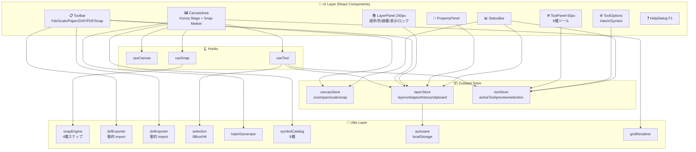
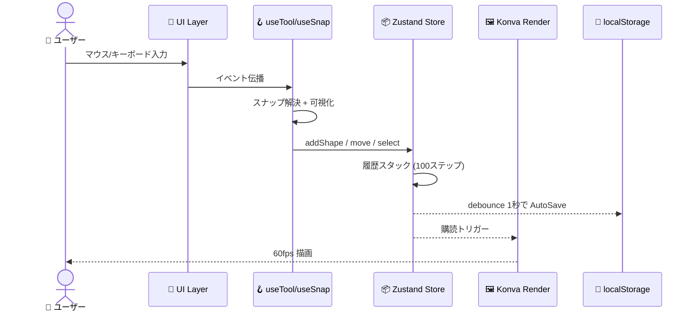
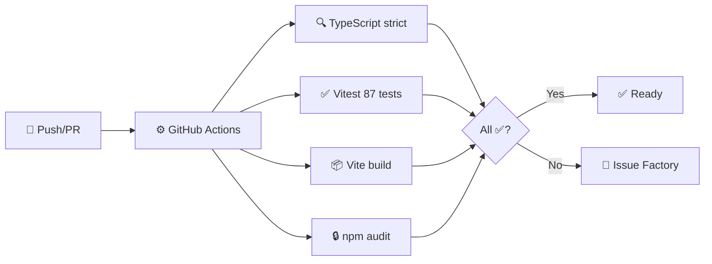
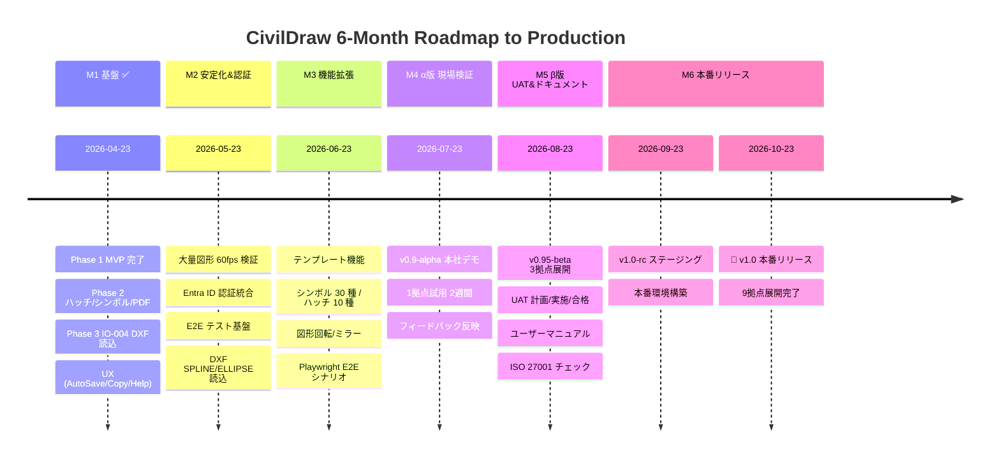

# 🏗️ CivilDraw

**建設土木業向け Web ベース 2D CAD ツール** — Construction Civil Engineering Web CAD

> 📄 **社内限ドキュメント番号**: CAD-REQ-2026-001 v1.0 | ITシステム運用管理部

[](https://github.com/Kensan196948G/Civil-Draw/actions/workflows/ci.yml)


> 📅 **プロジェクト期間**: 2026-04-23 〜 2026-10-23 (6ヶ月)
> 🚀 **本番リリース目標**: **2026-10-23 (絶対厳守)**
> 📋 詳細ロードマップ: [`ROADMAP.md`](./ROADMAP.md)

---

## 🎯 概要

AutoCAD 等の高価な商用 CAD に代わる、建設土木業に特化した内製 Web CAD ツールです。ブラウザのみで動作し、社内 9 拠点への展開を目的としています。

| 🧩 | 特徴 |
|---|---|
| 📐 | 仮設計画・土工計画・施工ヤード配置・道路舗装計画の平面図作成 |
| 📤 | DXF R2010 出力 + DXF 読込（AutoCAD 2010+ / JW-CAD 互換） |
| 🔒 | オフライン完全動作 / localStorage 自動保存 |
| ✅ | ISO 27001・J-SOX 準拠設計 |
| 🚀 | 動的 import でのコード分割・60fps 描画 |

---

## 🛠️ Tech Stack

| 区分 | 技術 | バージョン |
|------|------|-----------|
| ⚛️ フレームワーク | React + TypeScript | 18.x / 5.x |
| ⚡ ビルド | Vite | 5.x |
| 🎨 描画エンジン | Konva.js + react-konva | 9.x / 18.x |
| 📦 状態管理 | Zustand | 4.x |
| 📄 DXF 出力 | dxf-writer | 1.18.x |
| 📥 DXF 読込 | dxf-parser | 1.1.x |
| 💅 スタイル | Tailwind CSS | 3.x |
| ✅ テスト | Vitest + Testing Library | 2.x |

---

## 🚀 Getting Started

```bash
git clone https://github.com/Kensan196948G/Civil-Draw.git
cd Civil-Draw
npm install
npm run dev
```

🌐 ブラウザで `http://localhost:5173` を開く。

### 📝 主なコマンド

| コマンド | 説明 |
|----------|------|
| `npm run dev` | 🔧 開発サーバー起動 |
| `npm run build` | 📦 本番ビルド (dist/) |
| `npm run preview` | 👀 ビルド成果物プレビュー |
| `npm run test` | ✅ 全テスト実行 (87 tests) |
| `npm run test:coverage` | 📊 カバレッジ付きテスト |
| `npm run lint` | 🔍 ESLint + 型チェック |

---

## 🏛️ アーキテクチャ



### 🔄 データフロー



---

## 📁 ディレクトリ構成

```
src/
├── 🎨 components/
│   ├── Canvas/
│   │   ├── CanvasArea.tsx
│   │   ├── ShapeRenderer.tsx     # 8種の図形描画
│   │   └── SnapMarker.tsx        # スナップ可視化
│   ├── Toolbar/Toolbar.tsx       # ファイル・縮尺・スナップトグル
│   ├── ToolPanel/
│   │   ├── ToolPanel.tsx         # 9種ツール選択
│   │   └── ToolOptionsPanel.tsx  # ハッチ・シンボル設定
│   ├── LayerPanel/LayerPanel.tsx # 並べ替え・表示・ロック
│   ├── PropertyPanel/PropertyPanel.tsx
│   ├── HelpDialog.tsx            # F1 で表示
│   └── StatusBar.tsx
├── 🪝 hooks/
│   ├── useCanvas.ts
│   ├── useSnap.ts
│   └── useTool.ts               # 選択+ドラッグ+描画統合
├── 📦 store/
│   ├── canvasStore.ts
│   ├── layerStore.ts            # + Undo/Redo + Clipboard
│   └── toolStore.ts
├── 🔧 utils/
│   ├── dxfExporter.ts           # DXF R2010 + JSON
│   ├── dxfImporter.ts           # DXF R12+ 読込
│   ├── snapEngine.ts            # 4種スナップ
│   ├── selection.ts             # BBox・矩形選択
│   ├── hatchGenerator.ts        # ポリゴンクリップ
│   ├── symbolCatalog.ts         # 8シンボル
│   ├── autosave.ts              # localStorage + debounce
│   └── gridRenderer.ts
└── 📝 types/
    ├── geometry.ts              # 8種図形型
    └── layer.ts
```

---

## ✨ 機能一覧

### ✅ Phase 1 MVP (完了)

| ID | 機能 | 状態 |
|---|---|---|
| CV-001〜007 | キャンバス操作 / グリッド / 4種スナップ / 縮尺 / 用紙 | ✅ |
| DT-001 | 🖱️ 選択 (単体/Shift/矩形範囲) + ドラッグ移動 | ✅ |
| DT-002〜007 | ➖⬜⭕📐🔤↔️ 6種描画ツール | ✅ |
| DT-010 | ↩️ Undo/Redo 100ステップ | ✅ |
| LY-001〜006 | 📚 レイヤー管理 (並べ替え含む) | ✅ |
| IO-001〜003 | 📄 DXF 出力 / JSON 保存・読込 | ✅ |

### ✅ Phase 2 (完了)

| ID | 機能 | 詳細 |
|---|---|---|
| DT-008 | 🧱 ハッチング | 平行/クロス/土工(45°×)/砂利 |
| DT-009 | 🚧 シンボルライブラリ | 仮設/土工/測量/車両 8種 |
| IO-005 | 🖨️ PDF 出力 | window.print + @media print |

### ✅ Phase 3 部分完了

| ID | 機能 | 状態 |
|---|---|---|
| IO-004 | 📥 DXF 読込 (LINE/CIRCLE/POLYLINE/TEXT) | ✅ |
| — | 🔐 Entra ID 認証 | 未実装（運用・認証基盤） |
| — | 🌐 9拠点 Web 展開 | 未実装（インフラ） |

### 🎁 追加実装 (仕様書外 + UX)

| 機能 | 説明 |
|---|---|
| 📋 コピー/ペースト | Ctrl+C / Ctrl+V (オフセット付き) |
| 🔁 複製 | Ctrl+D でその場複製 |
| 💾 AutoSave | localStorage 自動保存・起動時復元 |
| 🎯 スナップ可視化 | 4種マーカー (端点/中点/交点/格子) |
| 🎚️ スナップトグル | 4種 ON/OFF をツールバーから制御 |
| 📚 レイヤー並べ替え | ▲/▼ ボタン |
| ❓ 操作ガイド | F1 / ? キーで表示 |

### 🧱 ハッチングパターン

| パターン | 用途 |
|----------|------|
| 平行線 | 舗装断面・一般ハッチ |
| クロス | 補強領域 |
| 土工 (45°×) | 土工断面 |
| 砂利 | 砕石層 |

### 🚧 シンボルライブラリ (8種)

| カテゴリ | シンボル |
|----------|---------|
| 仮設 | カラーコーン・仮囲い・信号機 |
| 土工 | 土砂山 |
| 測量 | 測量杭・基準点(BM) |
| 車両 | バックホウ・ダンプトラック |

---

## ⌨️ キーボードショートカット

| キー | 🎯 操作 |
|------|--------|
| `Ctrl + Z` | ↩️ Undo |
| `Ctrl + Y` | ↪️ Redo |
| `Ctrl + C` | 📋 コピー |
| `Ctrl + V` | 📄 ペースト |
| `Ctrl + D` | 🔁 複製 |
| `Delete` / `Backspace` | 🗑️ 選択削除 |
| `Escape` | ❌ キャンセル / 選択ツール |
| `Enter` / `Dblclick` | ✅ ポリライン・ハッチ確定 |
| `Space + ドラッグ` | ✋ パン |
| `マウスホイール` | 🔍 ズーム |
| `中ボタンドラッグ` | ✋ パン |
| `Shift + クリック` | ➕ 選択追加 |
| `F1` / `?` | ❓ ヘルプ表示 |

---

## 🔄 CI/CD



---

## 🌐 対応ブラウザ

| ブラウザ | バージョン |
|----------|-----------|
| 🟢 Google Chrome | 最新 2 バージョン |
| 🔵 Microsoft Edge | 最新 2 バージョン（社内標準） |

---

## 📆 6ヶ月ロードマップ (2026-04-23 → 2026-10-23)



詳細な月次タスクとリスク管理は [`ROADMAP.md`](./ROADMAP.md) を参照。

---

## 📊 品質基準 & 実績

| 指標 | 目標 | 実績 |
|------|------|------|
| 🧪 テストカバレッジ | 70%+ | ✅ **86%** |
| 📝 テスト数 | — | ✅ **87 passed** |
| 🔒 TypeScript strict | エラーゼロ | ✅ |
| 📦 初期バンドル | < 500KB | ✅ **485KB** (gzip 152KB) |
| ⚡ 60fps 維持 | 10,000図形まで | ✅ Konva 実装 |
| ✅ CI | All pass | ✅ (10 連続成功) |
| 🎯 GitHub Issues | Project 同期 | ✅ 9/9 Closed |

---

## 🔐 ライセンス・取り扱い

本ツールは社内限ドキュメントに基づき開発されています。図面データは外部サーバーに送信されず、すべてローカルで処理されます。

- 📄 DWG形式直接出力は不可 → DXF 経由で ODA File Converter で変換
- 🖼️ 印刷解像度はモニター依存（高精細印刷はPDF経由推奨）
- ☁️ クラウドストレージ連携は Phase 3 以降の検討事項
- 💾 AutoSave は localStorage 限定（他端末への同期なし）

---

*© 2026 ITシステム運用管理部*
