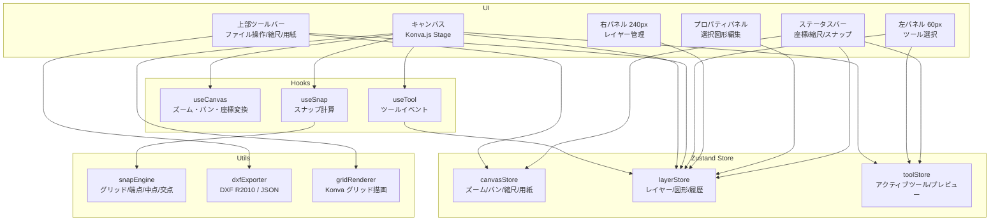

# CivilDraw

建設土木業向け Web ベース 2D CAD ツール — Construction Civil Engineering Web CAD

> **社内限ドキュメント番号**: CAD-REQ-2026-001 v1.0 | ITシステム運用管理部

[](https://github.com/Kensan196948G/Civil-Draw/actions/workflows/ci.yml)

## 概要

AutoCAD 等の高価な商用 CAD に代わる、建設土木業に特化した内製 Web CAD ツールです。ブラウザのみで動作し、社内 9 拠点への展開を目的としています。

- 仮設計画・土工計画・施工ヤード配置・道路舗装計画の平面図作成
- DXF R2010 出力（AutoCAD 2010+ / JW-CAD 互換）
- オフライン完全動作（外部サーバー通信なし）
- ISO 27001・J-SOX 準拠設計

## Tech Stack

| 区分 | 技術 | バージョン |
|------|------|-----------|
| フレームワーク | React + TypeScript | 18.x / 5.x |
| ビルド | Vite | 5.x |
| 描画エンジン | Konva.js + react-konva | 9.x / 18.x |
| 状態管理 | Zustand | 4.x |
| DXF 出力 | dxf-writer | 1.18.x |
| スタイル | Tailwind CSS | 3.x |
| テスト | Vitest + Testing Library | 2.x |

## Getting Started

```bash
git clone https://github.com/Kensan196948G/Civil-Draw.git
cd Civil-Draw
npm install
npm run dev
```

ブラウザで `http://localhost:5173` を開く。

## 主なコマンド

```bash
npm run dev          # 開発サーバー起動 (http://localhost:5173)
npm run build        # 本番ビルド (dist/)
npm run preview      # ビルド成果物プレビュー
npm run test         # Vitest 全テスト実行
npm run test:coverage # カバレッジ付きテスト
npm run lint         # ESLint + TypeScript 型チェック
```

## アーキテクチャ



## データフロー

```
ユーザー入力 (マウス/キーボード)
  → useSnap でスナップ座標解決（グリッド/端点/中点/交点）
  → useTool がアクティブツールに応じて図形を仮生成 (toolStore.previewShape)
  → 確定時: layerStore に図形追加 + 履歴スタック更新
  → Canvas が store を購読して Konva 再描画
  → 60fps 維持 (10,000 図形要素まで保証)
```

## ディレクトリ構成

```
src/
├── components/
│   ├── Canvas/          # Konva Stage/Layer のラッパー
│   │   ├── CanvasArea.tsx
│   │   └── ShapeRenderer.tsx
│   ├── Toolbar/         # 上部: ファイル操作・縮尺・用紙設定
│   ├── ToolPanel/       # 左サイドバー (幅60px)
│   ├── LayerPanel/      # 右サイドバー (幅240px)
│   ├── PropertyPanel/   # プロパティ編集パネル
│   └── StatusBar.tsx
├── hooks/
│   ├── useCanvas.ts     # ズーム・パン・座標変換
│   ├── useSnap.ts       # スナップ計算のコール
│   └── useTool.ts       # アクティブツールのイベントハンドラ切替
├── store/
│   ├── canvasStore.ts   # ズーム倍率・パン位置・縮尺・用紙設定
│   ├── layerStore.ts    # レイヤー一覧・図形データ・Undo/Redo
│   └── toolStore.ts     # 選択中ツール・描画中の一時ジオメトリ
├── utils/
│   ├── dxfExporter.ts   # DXF R2010 書き出し + JSON 保存/読込
│   ├── snapEngine.ts    # グリッド・端点・中点・交点スナップ
│   └── gridRenderer.ts  # グリッド線の Konva 描画
└── types/
    ├── geometry.ts      # 図形型定義 (Line/Rect/Circle/Polyline/Text/Dimension)
    └── layer.ts         # Layer 型定義 (色・線種・ロック状態)
```

## 機能一覧

### Phase 1 MVP (実装済み)

| 機能ID | 機能名 | 状態 |
|--------|--------|------|
| CV-001 | ズーム操作 (0.1x〜50x) | ✅ |
| CV-002 | パン操作 (Space+ドラッグ / 中ボタン) | ✅ |
| CV-003 | グリッド表示 (縮尺連動) | ✅ |
| CV-004 | スナップ (グリッド/端点/中点/交点) | ✅ |
| CV-005 | 座標表示 (実寸m) | ✅ |
| CV-006 | 縮尺設定 (1/50〜1/1000) | ✅ |
| CV-007 | 用紙設定 (A4〜A0 縦横) | ✅ |
| DT-001 | 選択・削除 | ✅ |
| DT-002 | 線分ツール | ✅ |
| DT-003 | 矩形ツール | ✅ |
| DT-004 | 円ツール | ✅ |
| DT-005 | ポリラインツール | ✅ |
| DT-006 | テキストツール | ✅ |
| DT-007 | 寸法線ツール | ✅ |
| DT-010 | Undo/Redo (Ctrl+Z/Y, 最大100ステップ) | ✅ |
| LY-001 | レイヤー追加/削除/名称変更 | ✅ |
| LY-002 | 表示/非表示 | ✅ |
| LY-003 | ロック機能 | ✅ |
| LY-004 | 色・線種・線幅設定 | ✅ |
| LY-005 | デフォルト5レイヤー | ✅ |
| LY-006 | DXF出力時レイヤー情報保持 | ✅ |
| IO-001 | DXF R2010 出力 | ✅ |
| IO-002 | JSON 内部保存 | ✅ |
| IO-003 | JSON 読込 | ✅ |

### Phase 2 (予定)

| 機能ID | 機能名 |
|--------|--------|
| DT-008 | ハッチングツール |
| DT-009 | 建設土木シンボルライブラリ |
| IO-005 | PDF 出力 |
| IO-006 | テンプレート機能 |

### Phase 3 (予定)

| 機能ID | 機能名 |
|--------|--------|
| IO-004 | DXF 読込 |
| - | Entra ID 認証連携 |
| - | 社内 9 拠点 Web 展開 |

## CI/CD

```
Push/PR → GitHub Actions
  ├── TypeScript strict チェック (tsc --noEmit)
  ├── Vitest テスト実行
  ├── Vite ビルド
  └── npm audit (security)
```

## キーボードショートカット

| キー | 操作 |
|------|------|
| Ctrl + Z | Undo |
| Ctrl + Y | Redo |
| Delete / Backspace | 選択図形削除 |
| Escape | 描画キャンセル / ツールリセット |
| Enter | ポリライン確定 |
| Space + ドラッグ | パン操作 |
| マウスホイール | ズーム |
| 中ボタンドラッグ | パン操作 |

## 対応ブラウザ

| ブラウザ | バージョン |
|----------|-----------|
| Google Chrome | 最新 2 バージョン |
| Microsoft Edge | 最新 2 バージョン（社内標準） |

## 開発フェーズ

```
Phase 1 MVP ✅ (2026-04-23)
  ↓
Phase 2 実用化 (ハッチング/シンボル/PDF)
  ↓
Phase 3 拡張 (DXF読込/Entra ID/9拠点展開)
```

## 品質基準

| 指標 | 目標 | 現状 |
|------|------|------|
| テストカバレッジ | 70%+ | テスト実行中 |
| TypeScript | strict: true | ✅ エラーゼロ |
| ビルドサイズ | — | 482KB (gzip: 150KB) |
| 60fps 維持 | 10,000図形まで | 実装済み (Konva) |

## ライセンス・取り扱い

本ツールは社内限ドキュメントに基づき開発されています。図面データは外部サーバーに送信されず、すべてローカルで処理されます。

---

*© 2026 ITシステム運用管理部*
