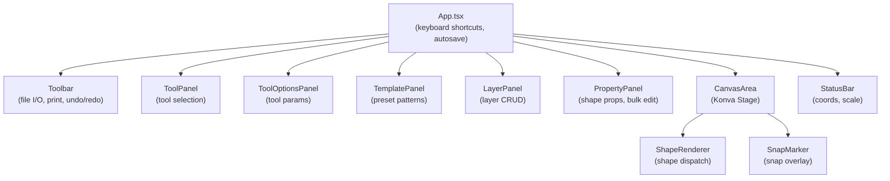
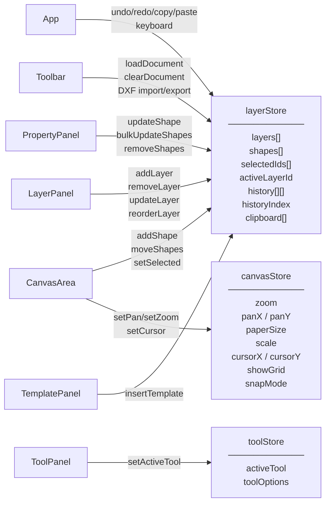
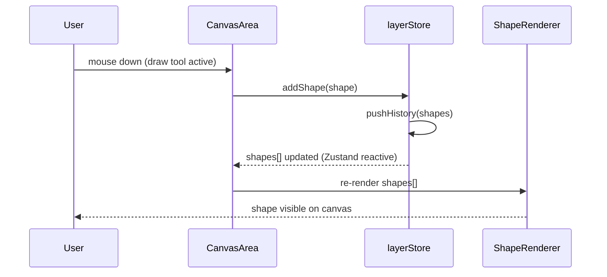
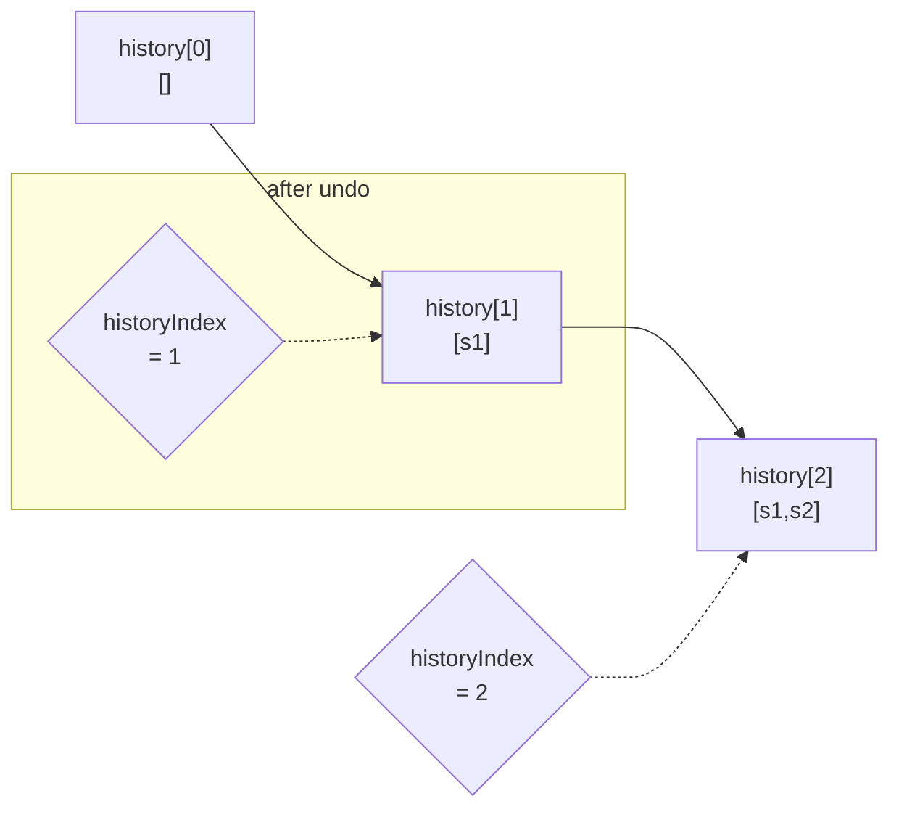
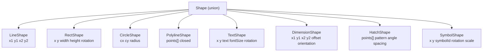

# Civil Draw — Architecture

## Overview

Civil Draw is a browser-based 2D CAD application for civil engineering drawings.
Built with React 18 + Vite + Zustand + Konva.js, targeting A0–A4 paper output at engineering scales (1:50 – 1:1000).

---

## Component Tree

---

## State Management

Three Zustand stores. Each has full test coverage in `*.test.ts`.

---

## Data Flow — Shape CRUD

---

## Data Flow — Undo/Redo

`undo()` decrements `historyIndex` and restores `shapes` from that snapshot.
`redo()` increments if `historyIndex < history.length - 1`.
History is capped at 100 entries (`HISTORY_LIMIT`).

---

## Shape Type System

All shapes share the `BaseShape` fields (`id`, `layerId`, `locked`).
Each type adds geometry-specific fields:

> **Coordinate system**: Canvas uses Y-down (screen coords). `worldX = (stageX - panX) / zoom`.
> All shape coordinates are stored in **world space** (mm at the drawing's native scale).

---

## Utility Modules

| Module | Purpose |
|--------|---------|
| `snapEngine.ts` | Grid + endpoint + midpoint snap. Returns closest snap point |
| `selection.ts` | Bounding-box hit test, multi-select rectangle |
| `shapeTransform.ts` | Rotate CW/CCW, mirror H/V around selection centroid |
| `viewportCulling.ts` | AABB cull — skips shapes outside viewport for perf |
| `hatchGenerator.ts` | Generates line segments for earth/gravel/asphalt/dots patterns |
| `symbolCatalog.ts` | Registry of civil engineering symbols (cone, barrier, BM, etc.) |
| `templateCatalog.ts` | Preset multi-shape templates with `DistributiveOmit` type safety |
| `dxfImporter.ts` | DXF → Shape[] (LINE, LWPOLYLINE, CIRCLE, TEXT, INSERT) |
| `dxfExporter.ts` | Shape[] → DXF R12 (entities section) |
| `autosave.ts` | `localStorage` snapshot with 1-second debounce |
| `perfHarness.ts` | FPS benchmark harness for rendering performance tests |

---

## Key Design Decisions

### 1. Zustand over Redux/Context
Zustand's selector-based subscriptions (`useLayerStore(s => s.shapes)`) prevent unnecessary re-renders.
Components subscribe only to the slices they need.

### 2. Konva.js for Canvas
Direct Canvas 2D rendering via Konva avoids the overhead of SVG DOM mutations for large drawings (1000+ shapes).
`viewportCulling.ts` further reduces draw calls by filtering off-screen shapes.

### 3. History as Shape[][]
The full shapes array is snapshotted per operation (not command-based delta).
This simplifies undo/redo at the cost of memory, mitigated by the 100-entry cap.
For civil drawings the typical shape count (< 500) keeps memory impact negligible.

### 4. DistributiveOmit for Template Types
`type DistributiveOmit<T, K extends keyof T> = T extends unknown ? Omit<T, K> : never`
This conditional type distributes over union members, preserving the discriminated union's `type` field.
Plain `Omit<Shape, K>` collapses the union to the intersection of all members.

### 5. DXF R12 for Interoperability
DXF R12 (AutoCAD Release 12) is the lowest-common-denominator format supported by all CAD tools.
More recent DXF features (HATCH entity, XDATA) are mapped to approximations for import.
