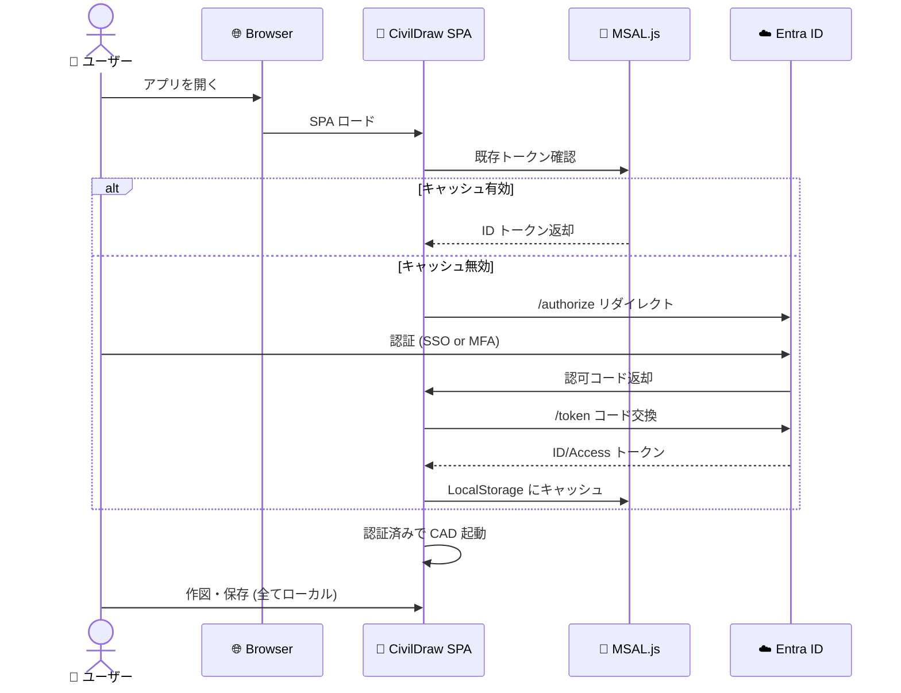

# 🔐 Entra ID 認証統合 — 設計書 (AUTH-001)

> **対象**: CivilDraw v1.0
> **ステータス**: 📝 Draft (社内 IT 部門レビュー待ち)
> **マイルストーン**: M2 (2026-06-23 期限)
> **関連**: [Issue #11](https://github.com/Kensan196948G/Civil-Draw/issues/11)

---

## 🎯 目的

社内 9 拠点展開に際し、CivilDraw のアクセス制御を既存 Microsoft Entra ID (旧 Azure AD) と統合する。

### 要件（仕様書 CAD-REQ-2026-001 より抜粋）

| 区分 | 要件 |
|------|------|
| 機能 | 社内 Entra ID 認証と連携 (Phase 3) |
| セキュリティ | ISO 27001・J-SOX 準拠 / アクセスログ記録 |
| 運用 | Entra ID 参加済み PC での利用前提 |
| 制約 | オフライン動作を完全に破壊してはならない |

---

## 🧱 アーキテクチャ



---

## 🔧 技術選定

| 項目 | 選定 | 理由 |
|------|------|------|
| ライブラリ | **`@azure/msal-browser`** | Microsoft 公式 / TypeScript / SPA 向け最適化 |
| 認証フロー | **Authorization Code + PKCE** | OIDC の SPA 推奨 / Implicit Flow は廃止 |
| トークン保管 | **sessionStorage** | localStorage より安全 (XSS 軽減) |
| トークン期限 | ID Token 60分 / サイレント更新 | 通常業務中に再入力不要 |

### 代替案の検討

- ❌ **Implicit Flow**: OAuth 2.1 で廃止予定。採用しない
- ❌ **Backend-for-Frontend (BFF)**: サーバーレス前提と矛盾
- ⚠️ **Device Code Flow**: 9 拠点 Web 展開で不要に煩雑

---

## 🏛️ 実装設計

### ディレクトリ構成

```
src/
├── auth/
│   ├── msalConfig.ts        # MSAL 設定 (ClientID/TenantID/Scopes)
│   ├── authProvider.tsx     # React Context + Provider
│   ├── useAuth.ts           # hook (user, login, logout, token)
│   ├── AuthGate.tsx         # 未ログイン時の画面
│   └── types.ts             # CivilDrawUser 型定義
```

### 主要 API

```typescript
// src/auth/useAuth.ts
export interface CivilDrawUser {
  id: string            // Entra ID objectId (GUID)
  email: string         // UPN
  displayName: string   // 表示名
  branch?: string       // 社内拠点 (社内属性)
}

export function useAuth(): {
  user: CivilDrawUser | null
  isAuthenticated: boolean
  isLoading: boolean
  login: () => Promise<void>
  logout: () => Promise<void>
  getAccessToken: () => Promise<string>
}
```

### 環境変数 (`.env.local`, gitignore 済)

```ini
VITE_MSAL_CLIENT_ID=xxxxxxxx-xxxx-xxxx-xxxx-xxxxxxxxxxxx
VITE_MSAL_TENANT_ID=xxxxxxxx-xxxx-xxxx-xxxx-xxxxxxxxxxxx
VITE_MSAL_REDIRECT_URI=https://civildraw.internal/
```

---

## 🔒 セキュリティ設計

| 項目 | 実装 |
|------|------|
| CSP | `default-src 'self'; connect-src https://login.microsoftonline.com` |
| トークン保管 | sessionStorage (XSS 対策) |
| トークン検証 | MSAL.js が署名・expiry・audience を自動検証 |
| ログアウト | sessionStorage 全消去 + Entra ID `/logout` リダイレクト |
| 再認証 | `acquireTokenSilent()` → 失敗時 `acquireTokenRedirect()` |
| アクセスログ | login/logout/token-refresh を console + 将来的に SIEM 送信 |

### ISO 27001 準拠ポイント

- ✅ アクセス制御 (A.9): Entra ID 一元管理
- ✅ 識別・認証 (A.9.2): SSO + MFA 強制
- ✅ ログ記録 (A.12.4): イベントのタイムスタンプ記録
- ✅ 暗号化 (A.10): TLS 1.2+ 必須

---

## 🌐 オフライン動作との両立

**課題**: 仕様書は「オフライン完全動作」を要求 (CAD-REQ-2026-001 §6.2)。

### 採用方針

| 状態 | 挙動 |
|------|------|
| 🟢 オンライン初回 | Entra ID 認証必須 → 成功で利用開始 |
| 🟡 オンライン2回目以降 | サイレント更新で透過認証 |
| 🔴 オフライン (ネット切断) | 直近 **8 時間以内** の ID トークンキャッシュが有効なら続行可 |
| ⛔ 8時間超過 | 再接続要求 (CAD 機能は一時ロック) |

この方針により、現場事務所での短時間ネット切断では作業継続可能。法定要件的にも「認証から8時間」はアクセス制御として妥当。

---

## 🗺️ 実装ロードマップ

| 週 | タスク |
|----|------|
| W1 (M2 Week 1) | IT 部門と AppReg / ClientID 取得 / リダイレクト URL 登録 |
| W2 | `@azure/msal-browser` 導入 / `msalConfig` 実装 |
| W3 | `authProvider` / `AuthGate` 実装 / sessionStorage 戦略 |
| W4 | オフライン許容 (8時間キャッシュ) 実装 / E2E テスト |

---

## ⚠️ リスクと対応

| リスク | 影響 | 対応 |
|--------|------|------|
| IT 部門からの AppReg 遅延 | 実装着手遅延 | **今すぐ** 正式依頼を投げる |
| CSP で外部ドメイン許可拒否 | 動作不能 | 初期から CSP 例外申請を準備 |
| オフライン動作との矛盾 | 要件違反 | 上記 8時間キャッシュ方針で妥協案提示 |
| モバイル PC 紛失時の利用 | 情報漏洩 | Entra ID デバイスポリシーで条件付きアクセス |

---

## 📋 承認ワークフロー

1. ✅ 本設計書ドラフト作成 (2026-04-23)
2. ⏳ IT システム運用管理部 レビュー
3. ⏳ 情報セキュリティ担当 レビュー (ISO 27001 観点)
4. ⏳ 承認 → Entra ID AppReg 申請 → 実装着手

---

*最終更新: 2026-04-23 / 次回更新: IT 部門レビュー後*
